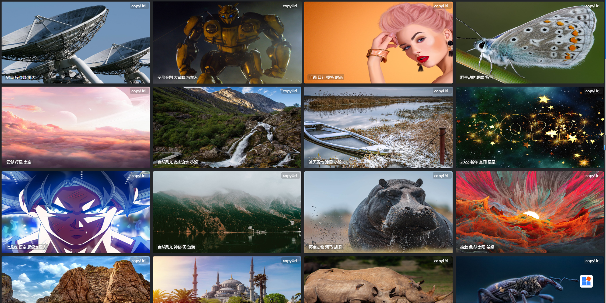

## 项目介绍

网站是一个集成的360壁纸站，支持搜索、分类、下载等，项目来自[wallpaper-360](https://github.com/ztyangt/wallpaper-360)，由于需要nginx代理，本修改换了一种解决方案，可以直接使用vercel部署

演示站：[https://www.png.cool](https://www.png.cool)

界面展示

## 优化内容
- 替换右下角图标
- 移除Nginx代理设置，支持vercel部署

## 360壁纸API

1. 获取壁纸分类

`http://cdn.apc.360.cn/index.php?c=WallPaper&a=getAllCategoriesV2&from=360chrome`

2. 根据分类ID获取壁纸

`http://wallpaper.apc.360.cn/index.php?c=WallPaper&a=getAppsByCategory&cid=${分类ID}&start=${从第几张图开始}&count=${每次加载的数量}&from=360chrome`

3. 获取最近更新壁纸

`http://wallpaper.apc.360.cn/index.php?c=WallPaper&a=getAppsByOrder&order=create_time&start=${从第几张图开始}&count=${每次加载的数量}&from=360chrome`

4. 壁纸搜索接口

`http://wallpaper.apc.360.cn/index.php?c=WallPaper&a=search&kw=${kw}&start=${start}&count=${count}`

5. 热门搜索

`http://openbox.mobilem.360.cn/html/api/wallpaperhot.html`

## 鸣谢
- [wallpaper-360](https://github.com/ztyangt/wallpaper-360)

